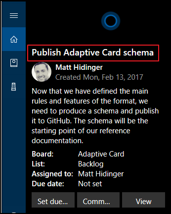
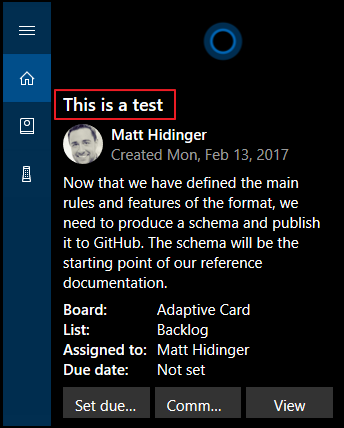

# Using Adaptive Cards in your skill

You can use a variety of interface elements, or *cards*, to enhance the user experience in your Cortana skill. The most versatile option is an Adaptive Card, a customizable card that can contain any combination of text, speech, images, buttons, and input fields.

Adaptive Cards provide:

* **Input controls**: You can add input controls for text, date, number, time, toggle switch and choice set.
* **Richer text**: Text in the cards is not limited to title, subtitle and text fixed formats. You can use a variety of font sizes, formats, and colors.
* **A single open card exchange format**: You can use your existing cards in a common and consistent way and extend them with rich controls using a common schema.

For more information about Bot Framework cards, see [Add rich card attachments to messages](https://docs.microsoft.com/en-us/bot-framework/dotnet/bot-builder-dotnet-add-rich-card-attachments) for .NET or [Add rich card attachments to messages](https://docs.microsoft.com/en-us/bot-framework/nodejs/bot-builder-nodejs-send-rich-cards) for Node.js. 

Adaptive Cards use an open card exchange format that lets you specify user interface content in your skill in a common and consistent way. You describe the content as a simple JSON object. That content can then be rendered natively by the skill, automatically adapting to the skill's look and feel.

Adaptive Cards can include elements, containers, actions, and inputs. A basic Adaptive Card is made up of: 

* The Adaptive Card root object.
* The Adaptive Card body, which includes the card's elements. 
* Any Adaptive Card's actions, which are typically displayed in an action bar at the bottom of the card.

The Adaptive Cards Visualizer provides an interactive preview environment where you can view and edit an adaptive card's JSON schema, and see the results in a preview pane:

https://adaptivecards.io/visualizer/

For example, the following text block provides the title text for the Adaptive Cards Visualizer's sample card:

    "type": "TextBlock",
    "text": "Publish Adaptive Card schema",
    "weight": "bolder",
    "size": "medium"

You can update the text block as follows to change the title text:

    "type": "TextBlock",
    "text": "This is a test",
    "weight": "bolder",
    "size": "medium"

To create an Adaptive Card using .NET, first install the `Microsoft.AdaptiveCards` NuGet package. You can then specify the elements of the card in code and add the card to your Cortana skill as an attachment. For example, the following code adds an Adaptive Card to a Cortana skill response:

    var response = context.MakeMessage();
    
    AdaptiveCard card = new AdaptiveCard();

    card.Body.Add(new TextBlock()
    {
        Text = "This is a test",
        Weight = TextWeight.Bolder
        Size = TextSize.Medium,
    });

    response.Attachments.Add(card.ToAttachment());

    await context.PostAsync(response);
    context.Wait(MessageReceived);

For more information about Adaptive Cards, see [Adaptive Cards](https://adaptivecards.io/). For an additional example of creating an Adaptive Card using .NET, see [Add an Adaptive card to a message](https://docs.microsoft.com/en-us/bot-framework/dotnet/bot-builder-dotnet-add-rich-card-attachments#adaptive-card).