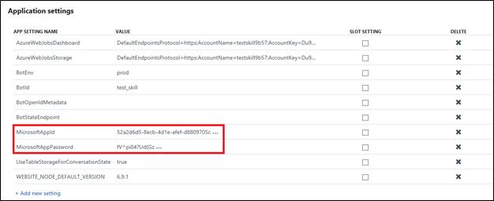
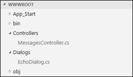
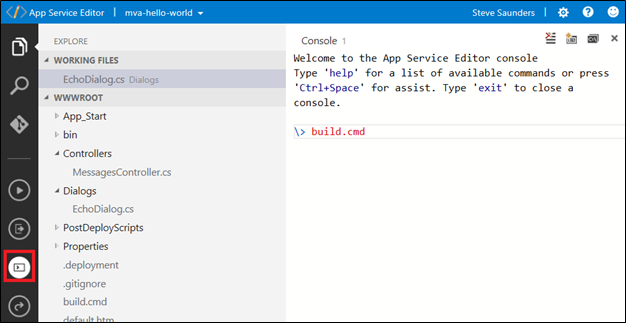
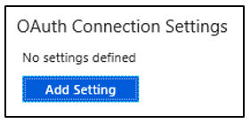

---
title: Adding authentication to your  Skills
description: Learn how to add authentication to your bot-based skill.
author: richbrun
label: Conceptual
ms.assetid: 182bda3b-5466-4337-8399-72598116cd9f
ms.author: v-stwohl
ms.date: 08/01/2017
ms.topic: article
ms.prod: cortana
keywords: cortana
---

# Adding authentication to your skill

> [!NOTE]
> This documentation provides details around authenticating skills built using the Microsoft Bot Framework.
> 


There are two ways to add authentication to your skill.

* Link a Connected Account to your skill
* Use Bot Framework's Sign-in card

## Link a Connected Account to a Cortana skill

If your skill uses a service that requires user authentication using OAuth, you can use Cortana's Connected Account feature to get an access token to use with the service. All you need to do is provide Cortana a few OAuth settings and she takes care of the rest for you.

You decide whether Cortana signs in the user when they invoke your skill or only when they activate a feature of your skill that requires authentication. Cortana initiates your identity server's sign in process, which prompts the user to sign in. If you use the code grant flow, Cortana automatically re-authenticates the user using a refresh token until they disconnect the skill in Cortana’s Notebook, the refresh token expires, or the user changes their password. 

Cortana Skills supports OAuth's Code Grant flow and Implicit Grant flow. For information about adding a connected account to your skill, see [Manage user identity](https://docs.microsoft.com/en-us/bot-framework/channel-connect-cortana#manage-user-identity) in Cortana's channel configuration.

The Connected Account feature supports using a single identity service. If your skill calls different services that use different identity services, you can use Connected Account with one of the services, but you need to use a different mechanism to authenticate the user with the other services.

<!--
## Bot Framework sign-in card

Cortana does not currently support Bot Framework's sign-in card. Please use the Connected Accounts feature to enable authorization for your skill. 
-->


## Getting the cached access token 


If you configure Cortana's channel for connected accounts, Cortana sends the authentication token to your skill as entity data. From the point you ask Cortana to authenticate the user, each message's `entities` property includes an `AuthorizationToken` object.


The `AuthorizationToken` object contains the following properties:

| Name     | Type     | Description              |
|----------|----------|--------------------------|
| type | string | The object's type, which is set to AuthorizationToken. 
| token    | string   | The access token. This field is null if the user canceled the sign-in process or didn't give consent. |
| status   | string   | The status of the access token. The following are the possible values.<ul><li>1&mdash;The `token` field contains a valid access token. </li><li>2&mdash;Sign-in succeeded. This value is set on the first message following user sign in. The `token` field contains the access token.</li><li>3&mdash;Sign-in canceled by user. The `token` field is set to null.</li></ul>  |

The following shows an example of the `AuthorizationToken` object.

```json
{                             
    "type": "AuthorizationToken",  
    "token": string,
    "status": string                                
}
```
## Use Bot Framework's sign-in card

This section describes using the basic C# code sample that will initiate the sign-in process of a Cortana skill. The result of using this code will create a reply message that requests a user to sign-in to use your skill. A Sign-in card typically contains text and one or more buttons that the user can click to initiate the sign-in process. 

### Use case for using a Sign-in Card

* If your Cortana skill requires a sign-in for your service that will handle authorization state and communication with your service, you may want to implement the authorization status using HTTP headers.

* If you are building a channel connector that supports authentication on top of sign-in cards like the Bot Framework OAuth card does, click the link below to view a code sample available in GitHub.

   https://github.com/Microsoft/botbuilder-dotnet/blob/master/libraries/Microsoft.Bot.Builder.Dialogs/Internal/OAuthPromptInternal.cs 

   **Note**: Web app bots implement sign-in card behavior in their channel connectors. For Cortana, this is a popup notification and a button in the Cortana canvas that will open another Edge pane on click of the button. 

### Prerequisites

Below are some prerequisites that you should be familiar with before attempting to add a Sign-in card to a Cortana skill. 

* **Have a Bot Framework bot created and connected to the Cortana channel.**

  **Note**: If you do not have a Bot Framework bot already created, or if you need information on how to connect a bot to the Cortana channel, refer to the **Quickstart guide Create your first skill**. 

* **Populate the OAuth configuration fields with your third-party service provider's user authorization and API authentication parameters.** 

  **Note**: The OAuth configuration fields are located under the *Default settings* tab of the Configure Cortana page.  Access to these fields occurs when you click the toggle switch located under the *Manage user identity through connected services* section.

* **Retrieve your App ID and App Password (i.e., MicrosoftAppID and MicrosoftAppPassword).** 

  **Note**: To retrieve your `MicrosoftAppId` and `MicrosoftAppPassword` in the Azure Bot Service portal, scroll down to *APP SERVICE SETTINGS* and click *Application Settings*. Next, scroll down to the *Application settings* section. It is here that you can retrieve your bot's App ID and App Password.

  

## Steps for adding a Sign-in card in C#

1. Sign into the [Microsoft Azure Portal](https://ms.portal.azure.com/). 

2. In the **Dashboard**, click the name of your bot.

3. Under **BOT Management**, click **Build**.

4. Click **Open online code editor**.

   **Note**: You may download and open the source code of your bot in your favorite integrated development environment. In this example, we are the browser-based Azure App Service Editor.

5. Expand the **Dialogs** tree under **WWWROOT**, and then click **EchoDialog.cs**.

   

6. To add a Sign-in card to your skill, copy and paste the C# code sample below the semicolon of the var reply in the **EchoDialog.cs**.

   **Note**: In the code sample, replace the sign-in URL ``https://login.microsoftonline.com`` with that of your service provider.

   ```
     Activity replyToConversation = message.CreateReply("Should go to conversation");
     replyToConversation.Attachments = new List<Attachment>();

     List<CardAction> cardButtons = new List<CardAction>();

     CardAction plButton = new CardAction()
     {
      Value = $"https://<OAuthSignInURL",
      Type = "signin",
      Title = "Connect"
     };

     cardButtons.Add(plButton);

     SigninCard plCard = new SigninCard(title: "You need to authorize me", button: plButton);

     Attachment plAttachment = plCard.ToAttachment();
     replyToConversation.Attachments.Add(plAttachment);

     var reply = await connector.Conversations.SendToConversationAsync(replyToConversation);
   
     // Copy and paste the C# code sample here in the EchoDialog.cs.

     else if(message.Text == "signin") {
     // make the reply message
     var replyMessage = context.MakeMessage();

     // make sign in card
     var signinCard = new SigninCard
       {
       Text = "Sign-in Card",
       Buttons = new List<CardAction> { new CardAction(ActionTypes.Signin,  "Sign-in please", value: "https://login.microsoftonline.com") }
       };
      // make an attachment
     Attachment attachment = signinCard.ToAttachment();

      // add attachment to message
     replyMessage.Attachments.Add(attachment);
     replyMessage.InputHint = InputHints.IgnoringInput; // Cortana hint that we are not listening while interacting with the login modal.

      // send the message
     await context.PostAsync(replyMessage);
     context.Wait(MessageReceivedAsync);  
     }
   ```
7. For the changes to take effect, redeploy the bot by clicking the **Open Console** icon or by pressing (**Ctrl+Shift+C**), and then enter **build.cmd** in the console window.

   

8. To determine if your Sign-in card has been added to your skill and displays the sign-in page of the third-party service provider, test the bot in Cortana.

   For more information on testing and debugging skills, see [Testing and debugging Cortana Skills](https://docs.microsoft.com/en-us/cortana/skills/test-debug).
    
   **Note**: To invoke this skill, type 'signin' in Cortana's serch box.

## Create an OAuth enabled Cortana Skill

The steps below will guide you through how to create an OAuth enabled Cortana skill. In this example, we already have a bot created in the Azure Bot Service that is using the Basic C# bot template.  If you do not have a bot already created and need information on how to get started, see [Create a bot with Bot Service](https://docs.microsoft.com/en-us/azure/bot-service/bot-service-quickstart?view=azure-bot-service-3.0). 

1. Sign into the [Microsoft Azure Portal](https://ms.portal.azure.com/). 

2. In the **Dashboard**, click the name of your bot.

3. Under **BOT MANAGEMENT**, click **Channels**.

4. To create the Cortana channel, click the Cortana icon.

   

   **Note**: If your bot is already connected to the Cortana channel, then click **Edit** to access the **Default settings**.

    

   **Additional Information**

   If you want the bot to support OAuth under Bot Framework by way of a channel other than Cortana, scroll down the Bot profile page to the*OAuth Connection Settings*, and then click **Add Settings**. Enter a name and click to select the service provider. The OAuth2 Generic Provider has similar OAuth configuration fields that you will populate in the following steps.

   

5. Scroll down the **Configure Cortana** page, and then click the toggle under **Cortana should manage my user’s identity**. 

   

6. Fill in the OAuth configuration field values.

   a. Enter the **Domain**. 

   **Note**: The domain can be anything such as your service domain.

   b. Enter the **Client ID**.

   **Note**: This is your *MicrosoftAppId* when you created your bot if you use Microsoft services, and the client ID is provided to you by your OAuth service provider.

   c. Enter your OAuth **Authorization URL**, for example:

   ``https://login.microsoftonline.com/common/oauth2/v2.0/authorize``
  
   **Note**: Replace common with your AAD tenant ID if you are restricting the resources to an organization. 

   or

   ``https://oauth.ticketmaster.com/oauth/authorize``

   d.	For the **Response method**, select **POST**.

   e.	For the **Response type**, select **Code**.

   **Note**: Code flow is easier than token flow. Refer to the [OAuth 2.0 Authorization Framework](https://tools.ietf.org/html/rfc6749) for more details.

   f. For the **Client authorization scheme**, select **Auth in body**. 

   **Note**: Auth in body is the most common way to send the identity payload.

   g.	Enter the **Client secret**.

   **Note**: This is your MicrosoftAppPassword, or your OAuth service provider's client secret. Your provider might have slightly different terminology (i.e., consumer secret).

   h.	Enter the **Token URL**, for example:

   ``https://login.microsoftonline.com/common/oauth2/v2.0/token``

    or

   ``https://oauth.ticketmaster.com/oauth/token``

   i.	For **Use tenant auth**, click this option if you will communicate with other services with the same identity provider (i.e., AAD).

   j.	For the **Redirect URL**, enter ``https://www.bing.com/agents/oauth``.

   **Note**: The Redirect URL gets called after the service provider performs the login, and it also causes the login canvas to close.

   k. For the **Scope**, enter the resources you are accessing. 

   **Note**: Your resource provider will tell you what SPACE DELIMITED resources you are asking for access to. Using Microsoft Graph as an example, you could set ``User.Read.ALl``, or for a third-party service like Ticket Master, you can pull ``all``.

   l.	For the **User Agent** and **Authorization header**, you may leave these fields blank unless your resource provider needs non-standard headers in the HTTP request.

   m.	Click **Sign in on demand** **only** if you want to put up your own OAuth card. For example, you can prompt the user for authorization only before access to a restricted resource.

7. Click **Connect to Cortana**.       

**Important!**

Visit your resource provider's web site to allow access to the resources. For Microsoft, visit the [My applications](https://apps.dev.microsoft.com/) portal, and select your skill.

Click **Add Platform**, **Web**, and make sure you register Cortana's redirect URL, and then save your changes. You do not need a log out URL.


**Note**: Other service providers will be different. You need to refer to their documentation on allowing the redirect callback. 

The result of following the above steps is that Cortana will open a dialog window to log in before proceeding to your skill. It is recommended that you test that your skill has an authorization token.

Each message will have an entity that contains the AuthorizationToken.  If it is not present, or if the token property is empty, it means you have not authenticated. The token can be empty if the token expires, and the correct solution would be to display an OAuthCard to reacquire a token.

The following C# code sample demonstrates how to get the authorization token.

```C#
 // Is the user auth'd?
string authAccessToken = String.Empty;

if (activity.Entities != null)


{
    foreach (var entity in activity.Entities)
    {
        if (entity.Type == "AuthorizationToken")
        {
            dynamic authResult = entity.Properties;
            authAccessToken = authResult.token;
        }
    }
}
```

```node.js
// Get access token from Cortana request
var tokenEntity = session.message.entities.find((e) => {
    return e.type === 'AuthorizationToken';
```

If the token is empty or if you clicked auth on demand, you can construct an OAuthCard for Cortana to request a login. 

**Note**: A C# sharp code sample will be coming soon.

```node.js

  builder.OAuthCard.create(connector, session, connectionName, "Please sign in", "Sign in", (createSignInErr, signInMessage) =>                   {
                        if(!createSignInErr) console.log( createSignInErr );
                        if (signInMessage) {
                            session.send(signInMessage);
                        } else {
                            session.send("Something went wrong trying to sign you in.");
                        }  
});
```

Now that you have the authorization token, below are a C# and node.js code samples that demonstrate how you add it to the request to your resource.

```C#

// Use access token to get user info from Live API
var url = "https://apis.live.net/v5.0/me?access_token=" + authAccessToken;
using (var client = new HttpClient())
{
    // Alternative way of passing an access_token is in the Authorization header
    // Example:
    // client.DefaultRequestHeaders.Add("Authorization", "Bearer " + authAccessToken);

    var response = await client.GetAsync(url);
```


```node.js

// Use access token to get user info from Live API
var url = 'https://apis.live.net/v5.0/me?access_token=' + tokenEntity.token;
request.get(url, (err, response, body) => {
```

**Note**: You should check for HTTP errors, and errors on the OAuth card such as a 401 (unauthorized) error.

  
 


 
 

     


## Next steps

If you use a Microsoft service that requires users with Microsoft accounts, see [Configure authentication for Microsoft's identity server](https://docs.microsoft.com/en-us/cortana/skills/configure-connected-account) for information about configuring Connected Account channel settings for Microsoft's identity server.
