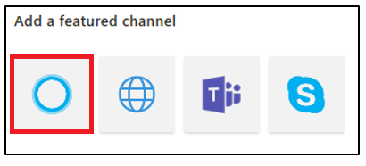
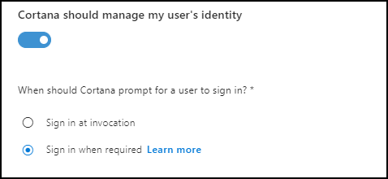

---
title: Adding Authentication to Your Cortana Skills
description: Learn how to add authentication to your bot-based skill.
label: Conceptual

ms.assetid: 182bda3b-5466-4337-8399-72598116cd9f
ms.date: 09/27/2018
ms.topic: article

keywords: cortana
---

# Adding Authentication to Your Cortana Skill  

>[!WARNING]
> Cortana Skills handle authentication differently than Microsoft Bot Framework.


There are two ways to add authentication to your Cortana Skill.  
*   Authenticate at Invocation  
*   Authenticate when Required  

## Link a Connected Account to a Cortana Skill  

If your skill uses a service that requires user authentication using OAuth 2.0, then you may use Connected Account feature in Cortana. The Connected Account feature in Cortana is used to get an access token for use with the service. All you must do is provide Cortana a few OAuth 2.0 settings and Cortana manages the rest for you.  

You decide whether Cortana signs in the user when they invoke your skill or only when they activate a feature of your skill that requires authentication. Cortana initiates the sign-in process on your identity server. The user is prompted to sign in. If you use the code grant flow, then Cortana automatically reauthenticates your user using a refresh token. Your user is reauthenticated until one of the following situations occurs.  
*  User disconnects the skill in Cortana Notebook  
   
   >[!NOTE]
   > Disconnect the skill in Cortana Notebook to clear the authentication state.  
   
*  Refresh token expires  
*  User changes password  

Cortana Skills supports the Code Grant flow and Implicit Grant flow for OAuth 2.0. For information about adding a connected account to your skill, visit the  [Manage user identity in the channel configuration for Cortana](https://docs.microsoft.com/bot-framework/channel-connect-cortana#manage-user-identity) section.  

The Connected Account feature supports using a single identity service. If your skill requests different services that use different identity services, then you may use Connected Account with one of the services. You may use Connected Account with another service, but you must use a different mechanism to authenticate your user with the service.  

## Get Your Cached Access Token  

If you configure the channel for connected accounts in Cortana, then Cortana sends the authentication token to your skill as entity data. From the point you ask Cortana to authenticate your user, the `entities` property for each message includes an `AuthorizationToken` object.  

The `AuthorizationToken` object includes the following properties.  

| Name     | Type     | Description              |  
|:---------|:---------|:-------------------------|  
| `type` | string | The type of the object. The only acceptable value is `AuthorizationToken`. 
| `token`    | string   | The access token. The value is `null` under the following conditions. <ul> <li>User cancels the sign-in process</li> <li>User does not give consent</li> </ul> |  
| `status`   | string   | The status of the access token. The following are the possible values. <ul> <li><code>0</code> : The `token` field is set to valid access token.</li> <li><code>1</code> : Sign in succeeded. This value is set on the first message following user sign in. The `token` field is set to valid access token.</li> <li><code>2</code> : Sign in canceled by user. The `token` field is set to `null`.</li> </ul>  |  

### Example of AuthorizationToken Object  

```json
{                             
    "type": "AuthorizationToken",  
    "token": string,
    "status": string                                
}
```  

## Create an OAuth Enabled Cortana Skill  

Create an OAuth 2.0-enabled Cortana skill using the following steps.  
Example: Creates a bot in Azure Bot Service using the Basic C# bot template.  

>[!NOTE]
> If you have not created a bot and looking for more information on how to get started, then visit the [Create a bot with Bot Service](https://docs.microsoft.com/azure/bot-service/bot-service-quickstart?view=azure-bot-service-3.0) page.  

1.  Sign into the [Microsoft Azure Portal](https://ms.portal.azure.com).  
2.  In the **Dashboard**, click the name of your bot. 
3.  Under **BOT MANAGEMENT**, click on the **Channels**. 
4.  To create the Cortana channel, click the Cortana icon. 

      

    >[!NOTE]
    > If your bot is already connected to the Cortana channel, then click **Edit** to access the **Default settings**.
    > 
    >   

5.  Scroll down the **Configure Cortana** page, under **Cortana should manage my user's identity**, click on the toggle.  

      

6.  Fill in the OAuth configuration field values.  
    Prompt user to Sign in.  

      

    1.  **Account Name**  
        The account name for your Cortana Skill.  
    2.  **Client ID**  
        The identifier for your client.  
        
        >[!NOTE]
        > If you use Microsoft services, then your `MicrosoftAppId` when you created your bot.  
        > If you use another OAuth 2.0 service provider, then the client ID provided to you.  
        
    3.  **Scope**  
        The resources you are accessing.  
        
        >[!NOTE]
        > Your resource provider informs you about the resources to which you are requesting.  
        > The resources must be *space delimited*.  
        > Example: Microsoft Graph, you may set `User.Read.ALl`.  
        > Example: A third-party service, you may set `all`.  

    4.  **Authorization URL**  
        Your OAuth Authorization URL.  
        
        ```url
        https://login.microsoftonline.com/common/oauth2/v2.0/authorize
        ```  
        
        >[!NOTE]
        > Replace `common` with your Azure AD tenant ID if you are restricting the resources to an organization. 
        
    5.  **Response method**  
        The HTTP verb for the response.  
        
        `POST`

    6.	**Response type**  
        The flow for the response.  
        `Code`
        
        >[!NOTE]
        > The code flow is easier than token flow.  
        > For more information, visit the [OAuth 2.0 Authorization Framework](https://tools.ietf.org/html/rfc6749) page.  

    7.  **Client authorization scheme**  
        
        `Auth in body`
        
        >[!NOTE]
        > The `Auth in body` scheme is the most common way to send the identity payload.  

    8.	**Client secret**  

        >[!NOTE]
        > If you use Microsoft services, then your `MicrosoftAppPassword` when you created your bot.  
        > If you use another OAuth 2.0 service provider, then the client secret provided to you. Your provider may use different terminology.  
        > Example: *consumer secret*.  

    9.	**Token URL**  
        
        ```url
        https://login.microsoftonline.com/common/oauth2/v2.0/token
        ```
        
        >[!NOTE]
        > If you are restricting the resources to an organization, then replace `common` with your Azure AD tenant ID.  

    10.	**Use tenant auth** | checkbox  
        If your Cortana Skill requires access to an intranet, then select this option.  
    11.	For the **User Agent**  
        Leave the field blank unless your resource provider needs non-standard headers in the HTTP request.  
    12. **Authorization header**  
        Leave the field blank unless your resource provider needs non-standard headers in the HTTP request.  
    13.	**Sign in on demand** | checkbox  
        If you are providing your own OAuth card, then select this option.  
        Example: Only if a user is accessing to a restricted resource, then you request authorization from your user.  

7.  Click on the `Connect to Cortana` link. 
            
    >[!IMPORTANT]
    > Visit your service provider site to grant access to the resources.  
    > *   For Microsoft: Visit the [My applications](https://apps.dev.microsoft.com) portal and select your Cortana Skill.  
    >     
    >     *   Click **Add Platform**, click **Web**, verify that you registered your redirect URL for Cortana, and then save your changes. You do not need a sign-out URL.  
    >     
    >           
    >
    > *   For Other service providers: Refer to the documentation from your service provider about allowing the redirect callback.  

8.  Cortana should open a dialog window to sign in before opening your Cortana Skill. Microsoft recommends that you verify that your Cortana Skill has an access token.  

    Each message includes an entity that includes the access token. If the access token is not present or if the access token property is empty, then it means you have not authenticated. The access token may be empty if the access token expires. When the access token expires, the correct solution is to display an OAuthCard to reacquire a token.

    Example: How to get your access token using C\#.

    ```csharp
    // Is the user authenticated?
    string authAccessToken = String.Empty;
    
    if (activity.Entities != null) {
        foreach (var entity in activity.Entities) {
            if (entity.Type == "AuthorizationToken") {
                dynamic authResult = entity.Properties;
                authAccessToken = authResult.token;
            }
        }
    }  
    ```  

    Example: How to get your access token using Node.js.  

    ```js
    // Get access token from Cortana request
    var tokenEntity = session.message.entities.find((e) => {
            return e.type === 'AuthorizationToken';
        }
    );
    ```

    If the token is empty or if you selected the *auth on demand* option, then you may construct an OAuthCard for Cortana to request a sign-in.  

    >[!NOTE]
    > A C\# code example is currently not available.  

    Example: Request a sign-in with an OAuthCard for Cortana using Node.js.  

    ```js
    builder.OAuthCard.create(connector, session, connectionName, "Please sign in", "Sign in", (createSignInErr, signInMessage) => {
            if(!createSignInErr) console.log( createSignInErr );
            if (signInMessage) {
                session.send(signInMessage);
            } else {
                session.send("Something went wrong trying to sign you in.");
            }  
        }
    );
    ```  

    Example: How to add your access token to your resource request using C\#.  

    ```csharp
    // Use access token to get user info from Live API
    var url = "https://apis.live.net/v5.0/me?access_token=" + authAccessToken;
    using (var client = new HttpClient())
    {
        // Alternative way of passing an access_token is in the Authorization header
        // Example:
        // client.DefaultRequestHeaders.Add("Authorization", "Bearer " + authAccessToken);
    
        var response = await client.GetAsync(url);
        ...
    }
    ```  

    Example: How to add your access token to your resource request using Node.js.  

    ```js
    // Use access token to get user info from Live API
    var url = 'https://apis.live.net/v5.0/me?access_token=' + tokenEntity.token;
    request.get(url, (err, response, body) => {
        }
    );
    ```  

    >[!NOTE]
    > You should check for errors and HTTP status codes on the OAuth card.  
    > Example: 
    > 
    > ```http status code
    > 401 unauthorized
    > ```  

## Next Steps  

If you use a Microsoft service that requires users with Microsoft accounts and looking for more information about configuring Connected Account channel settings for Microsoft identity server, then visit the [Configure authentication for Microsoft identity server](./configure-connected-account.md) page.  
