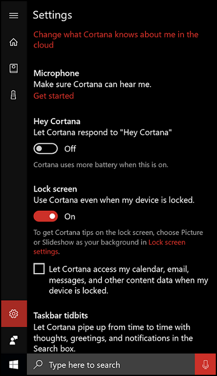

---
title: Creating a Cortana Skill
description: Shows how to create a bot-based Skill.

ms.assetid: d9cc74a2-af6d-452f-bd71-42fe27a5c673
ms.date: 10/12/2018

keywords: cortana
--- 

# Create Your First Cortana Skill

To create a skill, use [Bot Framework](https://docs.microsoft.com/bot-framework/) to create a speech bot. The framework provides a .NET SDK and Node.js SDK that you use to build your bot.  

>[!TIP]
> For an overview of how the framework works, see [How the Bot Framework works](https://docs.microsoft.com/azure/bot-service/bot-service-overview-readme?view=azure-bot-service-3.0).  

The following are the Bot Framework topics that contain the information that you need to build and deploy your first skill. 

## Use the Online Editor to Create Your Cortana Skill  

| Topic | Description |  
|:--- |:--- |  
| [Tutorial to Create your Cortana skill](./mva22-hello-world.md) | Tutorial to quickly build a bot for your Cortana Skill. |  
| [My bots List Configured for Cortana](https://dev.botframework.com/bots?c=cortana) | View or create  bots for your Cortana Skill. |  

## Use Visual Studio to Create Your Cortana Skill  

| Topic | Description |  
|:--- |:--- | 
|[Create a bot with .NET](https://docs.microsoft.com/azure/bot-service/dotnet/bot-builder-dotnet-sdk-quickstart?view=azure-bot-service-3.0) [Create a bot with Node.js](https://docs.microsoft.com/azure/bot-service/javascript/bot-builder-javascript-quickstart?view=azure-bot-service-3.0) | Guide that walks you through installing the SDK, creating your first bot, and running it.
|[Add speech to your bot with .NET](https://docs.microsoft.com/azure/bot-service/dotnet/bot-builder-dotnet-text-to-speech?view=azure-bot-service-3.0) [Add speech to your bot with Node.js](https://docs.microsoft.com/azure/bot-service/nodejs/bot-builder-nodejs-text-to-speech?view=azure-bot-service-3.0)|Shows the mechanisms that you use to add speech to bots.
|[Build a speech bot with .NET](https://docs.microsoft.com/azure/bot-service/dotnet/bot-builder-dotnet-cortana-skill?view=azure-bot-service-3.0) [Build a speech bot with Node.js](https://docs.microsoft.com/azure/bot-service/nodejs/bot-builder-nodejs-cortana-skill?view=azure-bot-service-3.0)|Shows how to add speech to bots.
|[Deploy a bot to the cloud](https://docs.microsoft.com/azure/bot-service/bot-service-build-continuous-deployment?view=azure-bot-service-3.0)|Shows how to deploy your bot to the cloud.

At this point, if you followed the steps in **Create a bot**, **Deploy a bot**, and **Add speech to your bot**, you successfully ran your skill in Bot Framework emulator. To run your skill locally in Cortana, you need to perform a couple of more steps. First, [register](https://docs.microsoft.com/azure/bot-service/bot-service-quickstart-registration?view=azure-bot-service-3.0) your bot to get your app ID and password. Then, [connect](https://docs.microsoft.com/azure/bot-service/bot-service-channel-connect-cortana?view=azure-bot-service-3.0) your skill to Configure Cortana channel. For this exercise, specify only the configuration settings listed under **General bot information**.

<!-- i hate duplicating work, but it may be useful to include a Hello, world example so they don't have to piece the example together from the two topics. -->

Configuring the Cortana channel adds your skill to Cortana on your computer. To ensure the skill has been added, visit the [My Bot List Configured for Cortana](https://dev.botframework.com/bots?c=cortana) page. You must sign into Bot Framework using the same Microsoft account that you used to register your Cortana Skill in Azure.  
For information about specifying an invocation name, see [Invocation name guidelines](./cortana-invocation-guidelines.md).

If you see your Cortana Skill in my Bots list filtered for Cortana, then you are able to invoke your skill from Cortana. But before invoking your skill, make sure:

1. You're signed into Cortana using the same Microsoft account that you used to register the skill in Bot Framework. To confirm:  
  1. Open Cortana by clicking **Type here to search** in the task bar.  
        
       
        
  2. Open Cortana Notebook by clicking the notebook icon.  
        
       
        
  3. Click **About Me**  
  4. Confirm the account shown is the same one you used to register your skill. If not, sign out and then sign back in with the correct account.  
  
2. Cortana microphone is enabled.  
  1. Open Cortana
  2. Open Cortana settings  
        
       
        
  3. Under **Microphone**, click **Get started**

When you're all set, click Cortana microphone and invoke your skill. For example, if your  invocation name is `Contoso Photo`, you can invoke your skill by saying, `Ask Contoso Photo to...` or `Tell Contoso Photo that...`. If Cortana recognizes your skill, she launches it and display it on her canvas.

If you encounter issues, see [Test your Cortana Skill](./test-debug.md).

## Next steps

To design the perfect skill, see [Skill design principles](./design-principles.md).

To make your skill smart, see [Add intelligence to your skill](https://docs.microsoft.com/azure/bot-service/bot-service-concept-intelligence?view=azure-bot-service-3.0). 

To add UI elements, see [Add cards to your skill using Node.js](https://docs.microsoft.com/azure/bot-service/nodejs/bot-builder-nodejs-send-rich-cards?view=azure-bot-service-3.0) or [Add cards to your skill using .NET](https://docs.microsoft.com/azure/bot-service/dotnet/bot-builder-dotnet-add-rich-card-attachments?view=azure-bot-service-3.0). Cortana supports [adaptive](https://docs.microsoft.com/azure/bot-service/nodejs/bot-builder-nodejs-send-rich-cards?view=azure-bot-service-3.0#send-an-adaptive-card), hero, thumbnail, receipt, and sign-in cards. In addition to cards, Node.js users can use a set of [built-in prompts](https://docs.microsoft.com/azure/bot-service/nodejs/bot-builder-nodejs-dialog-prompt?view=azure-bot-service-3.0) to simplify collecting inputs from a user. For example, you can use the `choice` prompt to present a list of choices that the user can pick from, or you can use the `confirm` prompt to confirm an action. For a list of prompts, see [Prompt types](https://docs.microsoft.com/azure/bot-service/nodejs/bot-builder-nodejs-dialog-prompt?view=azure-bot-service-3.0#prompt-types).

To add natural language understanding to your skill, see [Node.js](https://docs.microsoft.com/azure/bot-service/nodejs/bot-builder-nodejs-recognize-intent-luis?view=azure-bot-service-3.0) | [.NET](https://docs.microsoft.com/azure/bot-service/dotnet/bot-builder-dotnet-luis-dialogs?view=azure-bot-service-3.0).

To personalize your skill, see [Use the user's profile and contextual information](./get-user-profile-context.md).

To publish your skill to a group of friends or coworkers, or to publish it to the world, see [Publish your skill](./publish-skill.md).
<!--
Check out the Bot Framework speech samples. [Node.js](https://github.com/Microsoft/BotBuilder-Samples/tree/master/Node/demo-RollerSkill) | [.NET](https://github.com/Microsoft/BotBuilder-Samples/tree/master/CSharp/demo-RollerSkill)
-->
