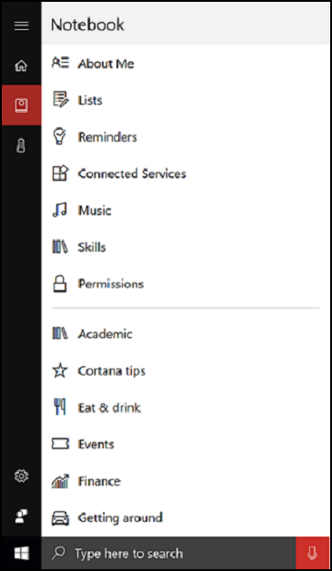

---
title: Creating a Cortana Skill
description: Shows how to create a bot-based Skill.
author: scottwhi-msft
manager: ehansen
label: Conceptual

ms.assetid: d9cc74a2-af6d-452f-bd71-42fe27a5c673
ms.author: scottwhi
ms.date: 9/22/2017
ms.topic: article
ms.prod: cortana
keywords: cortana
--- 

# Create your first skill

To create a skill, use [Bot Framework](https://docs.microsoft.com/en-us/bot-framework/) to create a speech bot. The framework provides a .NET SDK and Node.js SDK that you use to build your bot. For an overview of how the framework works, see [How the Bot Framework works](https://docs.microsoft.com/en-us/bot-framework/overview-how-bot-framework-works).

The following are the Bot Framework topics that contain the information that you need to build and deploy your first skill. 

|Topic|Description
|-|-
|[Create a bot with .NET](https://docs.microsoft.com/en-us/bot-framework/dotnet/bot-builder-dotnet-quickstart) [Create a bot with Node.js](https://docs.microsoft.com/en-us/bot-framework/nodejs/bot-builder-nodejs-quickstart)|Quick start guide that walks you through installing the SDK, creating your first bot, and running it.
|[Add speech to your bot with .NET](https://docs.microsoft.com/en-us/bot-framework/dotnet/bot-builder-dotnet-text-to-speech) [Add speech to your bot with Node.js](https://docs.microsoft.com/en-us/bot-framework/nodejs/bot-builder-nodejs-text-to-speech)|Shows the mechanisms that you use to add speech to bots.
|[Build a speech bot with .NET](https://docs.microsoft.com/en-us/bot-framework/dotnet/bot-builder-dotnet-cortana-skill) [Build a speech bot with Node.js](https://docs.microsoft.com/en-us/bot-framework/nodejs/bot-builder-nodejs-cortana-skill)|Shows how to add speech to bots.
|[Deploy a bot to the cloud](https://docs.microsoft.com/en-us/bot-framework/deploy-bot-overview)|Shows how to deploy your bot to the cloud.

At this point, if you followed the steps in **Create a bot**, **Deploy a bot**, and **Add speech to your bot**, you successfully ran your skill in Bot Framework's emulator. To run your skill locally in Cortana, you need to perform a couple of more steps. First, [register](https://docs.microsoft.com/en-us/bot-framework/portal-register-bot) your bot to get your app ID and password. Then, [connect](https://docs.microsoft.com/en-us/bot-framework/channel-connect-cortana) your skill to Bot Framework's Cortana channel. For this exercise, specify only the configuration settings listed under **General bot information**.

<!-- i hate duplicating work, but it may be useful to include a Hello, world example so they don't have to piece the example together from the two topics. -->

Configuring the Cortana channel adds your skill to Cortana on your computer. To ensure the skill has been added, open Cortana's [Dashboard](https://developer.microsoft.com/en-us/cortana/dashboard#!/home). You must sign in to the dashboard using the same Microsoft account that you used to register the skill in Bot Framework. For information about specifying an invocation name, see [Invocation name guidelines](cortana-invocation-guidelines.md).

If you see your skill in the dashboard, you can invoke your skill from Cortana. But before invoking your skill, make sure:

1. You're signed into Cortana using the same Microsoft account that you used to register the skill in Bot Framework. To confirm:  
  1. Open Cortana by clicking **Type here to search** in the task bar.  
        
       
        
  2. Open Cortana's Notebook by clicking the notebook icon.  
        
       
        
  3. Click **About Me**  
  4. Confirm the account shown is the same one you used to register your skill. If not, sign out and then sign back in with the correct account.  
  
2. Cortana's microphone is enabled.  
  1. Open Cortana
  2. Open Cortana's settings  
        
       
        
  3. Under **Microphone**, click **Get started**

When you're all set, click Cortana's microphone and invoke your skill. For example, if your skill's invocation name is "Northwind Photo", you can invoke your skill by saying, "Ask Northwind Photo to..." or "Tell Northwind Photo that...". If Cortana recognizes your skill, she launches it and display it on her canvas.

If you encounter issues, see [Test your Cortana Skill](test-debug.md).

## Next steps

To design the perfect skill, see [Skill design principals](design-principles.md).

To make your skill smart, see [Add intelligence to your skill](https://docs.microsoft.com/en-us/bot-framework/cognitive-services-bot-intelligence-overview). 

To add UI elements, see [Add cards to your skill using Node.js](https://docs.microsoft.com/en-us/bot-framework/nodejs/bot-builder-nodejs-send-rich-cards) or [Add cards to your skill using .NET](https://docs.microsoft.com/en-us/bot-framework/dotnet/bot-builder-dotnet-add-rich-card-attachments). Cortana supports [adaptive](https://docs.microsoft.com/en-us/bot-framework/nodejs/bot-builder-nodejs-send-rich-cards#send-an-adaptive-card), hero, thumbnail, receipt, and sign-in cards. In addition to cards, Node.js users can use a set of [built-in prompts](https://docs.microsoft.com/en-us/bot-framework/nodejs/bot-builder-nodejs-dialog-prompt) to simplify collecting inputs from a user. For example, you can use the `choice` prompt to present a list of choices that the user can pick from, or you can use the `confirm` prompt to confirm an action. For a list of prompts, see [Prompt types](https://docs.microsoft.com/en-us/bot-framework/nodejs/bot-builder-nodejs-dialog-prompt#prompt-types).

To add natural language understanding to your skill, see [Node.js](https://docs.microsoft.com/en-us/bot-framework/nodejs/bot-builder-nodejs-recognize-intent-luis) | [.NET](https://docs.microsoft.com/en-us/bot-framework/dotnet/bot-builder-dotnet-luis-dialogs).

To personalize your skill, see [Use the user's profile and contextual information](get-user-profile-context.md).

To publish your skill to a group of friends or coworkers, or to publish it to the world, see [Publish your skill](publish-skill.md).

Check out the Bot Framework's speech samples. [Node.js](https://github.com/Microsoft/BotBuilder-Samples/tree/master/Node/demo-RollerSkill) | [.NET](https://github.com/Microsoft/BotBuilder-Samples/tree/master/CSharp/demo-RollerSkill)
